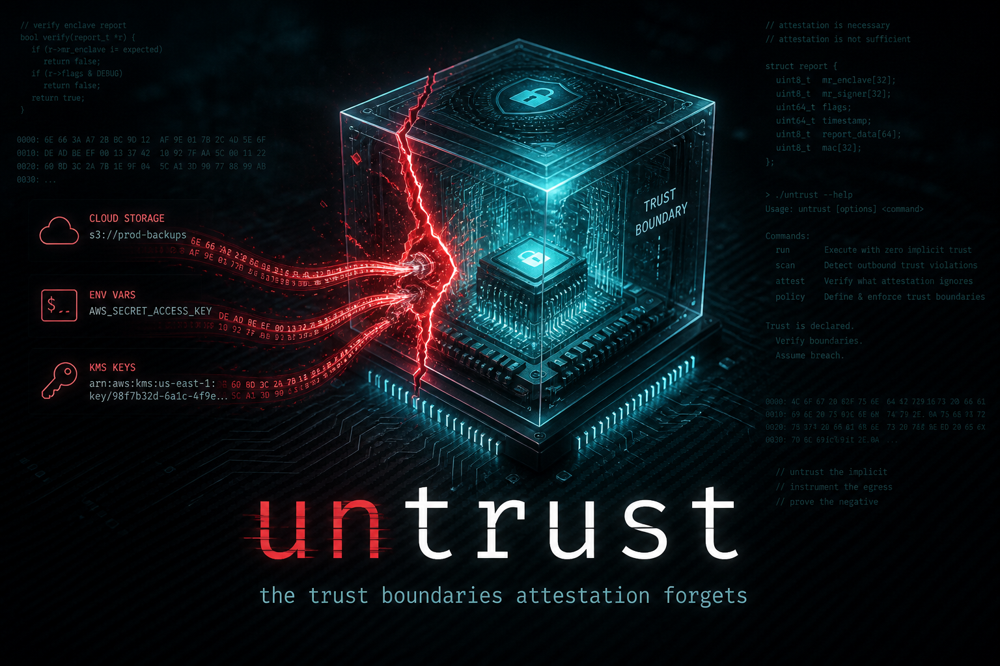
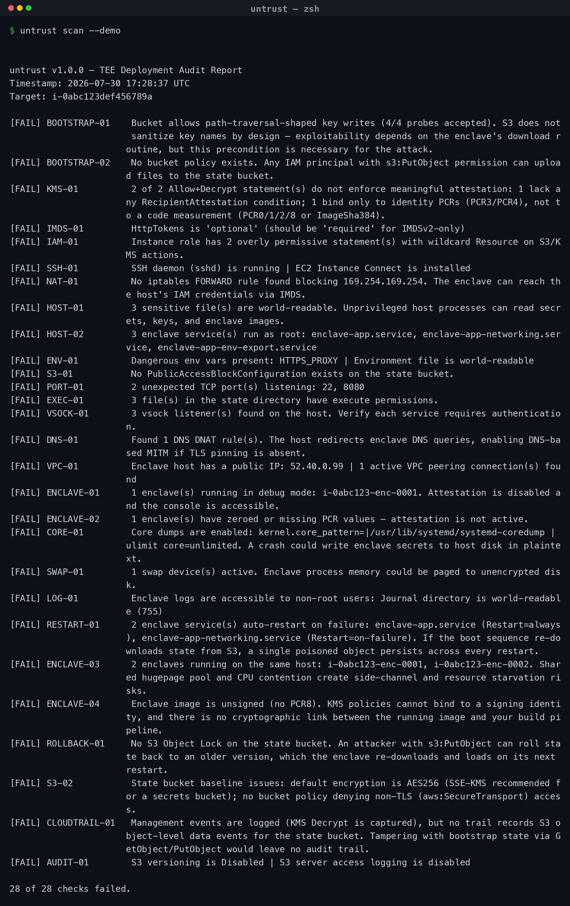
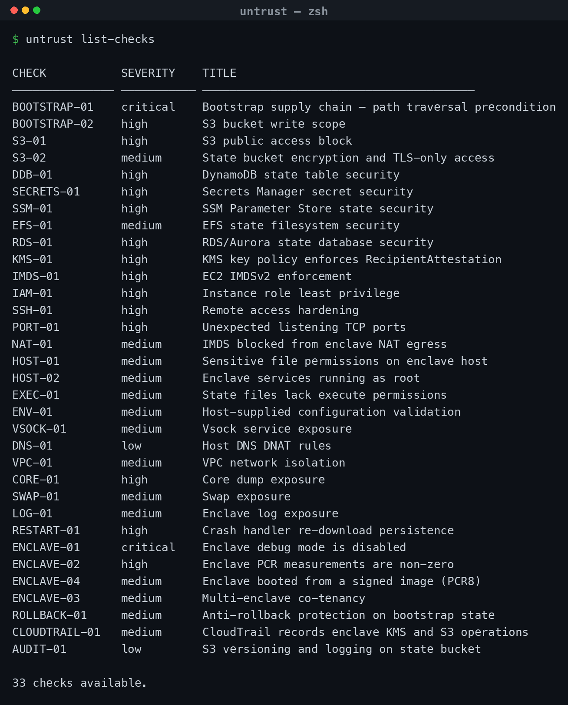

<p align="center">
  
</p>

<h1 align="center">untrust</h1>

<p align="center"><em>A TEE deployment auditor for the trust boundaries that attestation forgets.</em></p>

<p align="center">
  <a href="https://pypi.org/project/untrust/"></a>
  
  <a href="LICENSE"></a>
  
  
  <a href="https://defcon.org/"></a>
</p>

Cloud TEEs (AWS Nitro Enclaves, AMD SEV-SNP, Intel TDX) promise that a fully compromised host cannot reach into a hardware-isolated enclave. The cryptographic attestation story is sound. The deployment story is not.

Every TEE workload has to receive *something* from outside: bootstrap state from cloud object storage, environment variables from the host, KMS keys whose policies should but often don't enforce attestation. None of these inputs are protected by the attestation guarantee. All of them have been used in real exploitation.

`untrust` audits the trust boundaries TEE attestation does not cover, and produces a pass/fail report with concrete remediation guidance.

---

## Why this exists

`untrust` was built after a real adversarial simulation in which a single cloud storage write permission was sufficient for full Remote Code Execution as root inside a hardware-isolated enclave. The bug was a path traversal in the bootstrap state download — a class of vulnerability from 1998 that defeated a trillion-dollar trust boundary.

The talk presenting this research was delivered at **DEF CON 34** (August 2026): *"The Enclave Is Lying to You: Breaking TEE Trust Boundaries Through Boot-Time State."*

---

## Installation

```bash
pip install untrust
```

Requires Python 3.10+ and AWS credentials configured (for live scans).

---

## Quickstart

### Live scan against a real deployment

```bash
untrust scan \
  --target-bucket my-enclave-state \
  --kms-key-id arn:aws:kms:us-west-2:111111111111:key/abc... \
  --instance-id i-0abc123 \
  --region us-west-2 \
  --output report.json
```

### Demo mode (no AWS credentials needed)

```bash
untrust scan --demo
```

### Sample output

Running `untrust scan --demo` against the built-in simulated deployment:

<p align="center">
  
</p>

List every check and its severity with `untrust list-checks`:

<p align="center">
  
</p>

---

## What it audits

33 checks across eight categories, each mapped to a real-world exploitation path.

### Bootstrap & Supply Chain

| Check | What it verifies | Failure enables |
|-------|-----------------|-----------------|
| **BOOTSTRAP-01** | Does the S3 bucket accept path traversal key names (`../`) in the state prefix? | Enclave RCE via a single object upload |
| **BOOTSTRAP-02** | Does the bucket policy restrict `s3:PutObject` to specific principals? | Any IAM principal can plant files in the enclave's state |

### Object Storage (state bucket)

| Check | What it verifies | Failure enables |
|-------|-----------------|-----------------|
| **S3-01** | Are all four S3 Public Access Block settings enabled? | Public exposure of bootstrap state |
| **S3-02** | Is default SSE-KMS encryption on, and a TLS-only (`aws:SecureTransport`) deny in place? | Plaintext-at-rest and in-transit MITM of state |
| **ROLLBACK-01** | Is S3 Object Lock (WORM) protecting state from rollback? | Attacker rolls state back to an older valid version the enclave re-loads |
| **AUDIT-01** | Is versioning and server access logging enabled on the state bucket? | Silent overwrite with no forensic trail |

### Alternative state backends

The bootstrap-state trust boundary is backend-agnostic — attestation covers none of these. If the enclave loads state from something other than S3, target it with the matching flag (`--dynamodb-table`, `--secret-arn`, `--parameter-path`, `--efs-id`, `--db-instance`). Each check skips unless its backend is named.

| Check | What it verifies | Failure enables |
|-------|-----------------|-----------------|
| **DDB-01** | DynamoDB state table: customer-managed CMK, PITR, deletion protection, resource-policy write scope, data-event audit | Item tampering/rollback, attestation-ungated decrypt, unaudited writes |
| **SECRETS-01** | Secrets Manager: customer-managed CMK, rotation, non-wildcard resource policy, data-event audit | Attestation-ungated secret retrieval, cross-account/wildcard read |
| **SSM-01** | Parameter Store: `SecureString` under a customer-managed CMK (not `alias/aws/ssm`) | Plaintext config/secret reads; attestation-ungated decrypt |
| **EFS-01** | EFS/EBS state filesystem: CMK encryption, TLS-enforcing FS policy, backups | Open mount, plaintext-at-rest, no recovery from tampering |
| **RDS-01** | RDS/Aurora: CMK storage encryption, not public, no `0.0.0.0/0` ingress, IAM auth, deletion protection, no public snapshots | Direct DB reach, static-password auth, public snapshot exfil |

### KMS & Attestation

| Check | What it verifies | Failure enables |
|-------|-----------------|-----------------|
| **KMS-01** | Does every Allow+Decrypt statement enforce attestation on a **real code measurement** (not all-zeros, not identity-only PCR3/PCR4)? | KMS bypass without an enclave, or a debug enclave decrypting production keys |

### IAM & Access Control

| Check | What it verifies | Failure enables |
|-------|-----------------|-----------------|
| **IMDS-01** | Is IMDSv2 enforced (`HttpTokens: required`)? | Unauthenticated credential theft via HTTP GET |
| **IAM-01** | Does the instance role have wildcard `*` on S3/KMS resources? | Enclave or attacker can access any bucket/key in the account |
| **SSH-01** | Is SSH disabled and EC2 Instance Connect removed? | Lateral movement via `SendSSHPublicKey` permission |

### Network & Host

| Check | What it verifies | Failure enables |
|-------|-----------------|-----------------|
| **NAT-01** | Does the host's network bridge filter IMDS from enclave traffic? | Host IAM credential theft from inside the enclave |
| **PORT-01** | Are there unexpected listening TCP ports on the host? | Extra remote attack surface |
| **HOST-01** | Are sensitive files (EIF, keys, secrets, env) restricted permissions? | Unprivileged credential/image theft |
| **HOST-02** | Do enclave-related systemd services run as non-root? | Instant root on service compromise |
| **EXEC-01** | Are state-directory files free of execute permissions? | Host code execution via a replaced state file |
| **VSOCK-01** | Are there vsock listeners that need manual auth review? | Unauthenticated host→enclave RPC surface |
| **DNS-01** | Does the host DNAT-redirect DNS from the enclave? | DNS-based MITM if TLS pinning is absent |
| **VPC-01** | Is the host free of public IPs, VPC peering, and transit-gateway attachments? | Broadened network reachability to the enclave host |

### Host Memory & Persistence Hygiene

| Check | What it verifies | Failure enables |
|-------|-----------------|-----------------|
| **CORE-01** | Are core dumps disabled? | A crash writes enclave-adjacent secrets to host disk in plaintext |
| **SWAP-01** | Is swap disabled? | Process memory paged to unencrypted disk |
| **LOG-01** | Are enclave journal logs restricted to root? | Unprivileged log access leaking key/token context |
| **RESTART-01** | Do enclave services avoid auto-restart + re-download of untrusted state? | Persistent re-exploitation on every restart from one poisoned object |

### Enclave Runtime

| Check | What it verifies | Failure enables |
|-------|-----------------|-----------------|
| **ENCLAVE-01** | Is the enclave running outside debug mode? | Debug enclaves zero all PCRs, defeating attestation |
| **ENCLAVE-02** | Are the enclave's PCR measurements present and non-zero? | Attestation not actually active |
| **ENCLAVE-03** | Is only one enclave running per host? | Shared hugepage/CPU contention and co-tenancy side-channels |
| **ENCLAVE-04** | Was the enclave booted from a **signed** EIF (PCR8), signature verified? | No signing identity to bind KMS to; no link to the build pipeline |

### Configuration

| Check | What it verifies | Failure enables |
|-------|-----------------|-----------------|
| **ENV-01** | Are host-supplied env files free of dangerous variables and semantically valid? | Traffic redirection (HTTPS_PROXY), state injection (BUCKET_NAME) |

### Detection & Forensics

| Check | What it verifies | Failure enables |
|-------|-----------------|-----------------|
| **CLOUDTRAIL-01** | Is a trail logging management events (KMS `Decrypt`) and S3 data events for the state bucket? | Live KMS interception and state tampering leave no audit trail |

---

## What `untrust` deliberately does *not* check (and why)

An honest scanner names its own blind spots. These threats are real, but a
deployment-config scanner cannot meaningfully test them — they require code
review, runtime introspection *inside* the enclave, or are the hardware
vendor's responsibility. Cross-referenced against the Confidential Computing
Consortium threat model, MITRE/COIN enclave-interface research, Trail of Bits'
Nitro attack-surface notes, and recent academic work (SGX.Fail, TEE.Fail).

| Threat | Why it's out of scope | Where it belongs |
|--------|----------------------|------------------|
| **Entropy source** (`rng_current` = `nsm-hwrng`) and **clock source** (`kvm-clock`) | Only observable *inside* the enclave; no host/SSM path in | Enclave runtime self-check |
| **Attestation nonce / timestamp freshness** | A property of the enclave's attestation-consuming code, not deploy config | Application code review |
| **Constant-time crypto / timing side-channels** | Requires code and microarchitectural analysis | Application code review |
| **vsock interface input validation** (MITRE COIN: Concurrent, Order, Inputs, Nested) | The bidirectional host↔enclave protocol is app-defined; `VSOCK-01` only flags that a listener exists | Application code review / fuzzing |
| **Physical & microarchitectural attacks** (TEE.Fail DDR interposition, Battering RAM, Wiretap, L3 cache) | Hardware/vendor layer; Nitro exposes no customer memory-encryption-key path and no physical operator access | AWS-managed / accepted risk |
| **Reproducible builds & independent PCR verification** | A CI/CD process control (e.g., quorum builds), not a runtime state | Build pipeline / supply-chain policy |

---

## CLI Reference

```bash
# Run all checks
untrust scan --target-bucket BUCKET --kms-key-id KEY --instance-id INSTANCE

# Audit a non-S3 state backend (any combination)
untrust scan --dynamodb-table TABLE --kms-key-id KEY
untrust scan --secret-arn ARN
untrust scan --parameter-path /enclave/
untrust scan --efs-id fs-0123 --db-instance prod-db

# Passive scan only — skip intrusive checks (the S3 write probe and all
# host/nitro-cli SSM commands) to avoid tripping SOC/EDR detections
untrust scan --target-bucket BUCKET --kms-key-id KEY --instance-id INSTANCE --read-only

# Run in demo mode (simulated vulnerable deployment)
untrust scan --demo

# Output JSON report
untrust scan --demo --output report.json
untrust scan --demo --json

# List available checks
untrust list-checks

# Version
untrust --version
```

---

## JSON Output

The `--output` and `--json` flags produce structured output suitable for integration with CI/CD pipelines, SIEM systems, or security dashboards:

```json
{
  "version": "1.0.0",
  "timestamp": "2026-08-24T14:30:22.000000+00:00",
  "target": {
    "bucket": "enclave-state-XXXXXXXXXXXX",
    "kms_key_id": "arn:aws:kms:us-west-2:XXXXXXXXXXXX:key/demo-key-id",
    "instance_id": "i-0abc123def456789a",
    "region": "us-west-2"
  },
  "summary": {
    "total": 28,
    "pass": 0,
    "fail": 28,
    "skip": 0,
    "error": 0
  },
  "findings": [...]
}
```

---

## Roadmap

- **v1.0 (DEF CON 34, August 2026):** AWS Nitro Enclaves, 33 checks (S3 + DynamoDB/Secrets Manager/SSM/EFS/RDS state backends), JSON output
- **v1.1:** SARIF output format for GitHub Advanced Security integration
- **v2.0:** AMD SEV-SNP attestation policy auditing
- **v2.1:** Intel TDX bootstrap integrity checks
- **v3.0:** Azure Confidential Containers, GCP Confidential VMs
- **Future:** Plugin API for vendor-specific TEE platforms

Contributions welcome. See [CONTRIBUTING.md](CONTRIBUTING.md).

---

## How it works

`untrust` uses the AWS SDK (boto3) and SSM to inspect the target deployment. It combines several families of checks (run `untrust list-checks` for the full set of 33):

- **Cloud-API checks** read S3, KMS, EC2, IAM, and CloudTrail configuration directly — e.g. `KMS-01` performs semantic key-policy evaluation (rejecting all-zeros and identity-only PCR conditions), `ROLLBACK-01` reads S3 Object Lock, `S3-02` reads bucket encryption and the TLS-only policy, and `CLOUDTRAIL-01` confirms KMS/S3 activity is actually logged.
- **Alternative-backend checks** apply the same storage-plane controls to non-S3 state stores when targeted: DynamoDB (`DDB-01`), Secrets Manager (`SECRETS-01`), SSM Parameter Store (`SSM-01`), EFS/EBS (`EFS-01`), and RDS/Aurora (`RDS-01`). Each checks for a customer-managed CMK (so `KMS-01` attestation can gate it), least-privilege/non-public access, anti-rollback, and audit coverage. CMK status is resolved authoritatively via `kms:DescribeKey` (`KeyMetadata.KeyManager`) — a string check cannot distinguish an AWS-managed service key from a customer CMK, since both surface as a resolved key ARN.
- **Host checks (via SSM `AWS-RunShellScript`)** run read-only commands on the parent instance — SSH/port/service posture, file and exec permissions, IMDS filtering, DNS DNAT, core-dump/swap/journal hygiene, and restart persistence.
- **Enclave-runtime checks (via SSM + `nitro-cli`)** confirm the enclave is out of debug mode, has non-zero PCRs, is not co-tenant, and was booted from a signed EIF (`describe-eif` → PCR8 + signature check).
- **BOOTSTRAP-01** additionally uploads canary objects with path-traversal key names and deletes any that succeed. A write that is *rejected* — with a `403 AccessDenied` **or** any other client-side (`4xx`) response such as a `400` from a bucket policy/encryption condition — is treated as **blocked (PASS)**, since the object never lands. Only transient/server-side failures (throttling, `5xx`) are reported as `ERROR`.

### Read-only mode

`untrust scan --read-only` runs the passive cloud-API checks only and skips the intrusive ones — the `BOOTSTRAP-01` write probe and every host/enclave check that shells into the instance via SSM `AWS-RunShellScript`. Use it when you need a posture snapshot without generating write events or on-host command execution that a SOC/EDR pipeline might flag.

### Required IAM permissions

The scanning identity needs the following permissions:

```json
{
  "Version": "2012-10-17",
  "Statement": [
    {
      "Sid": "UntrustS3Checks",
      "Effect": "Allow",
      "Action": [
        "s3:PutObject",
        "s3:DeleteObject",
        "s3:GetBucketVersioning",
        "s3:GetBucketLogging",
        "s3:GetBucketPolicy",
        "s3:GetBucketPublicAccessBlock",
        "s3:GetEncryptionConfiguration",
        "s3:GetBucketObjectLockConfiguration"
      ],
      "Resource": [
        "arn:aws:s3:::YOUR-STATE-BUCKET",
        "arn:aws:s3:::YOUR-STATE-BUCKET/*"
      ]
    },
    {
      "Sid": "UntrustKms",
      "Effect": "Allow",
      "Action": "kms:GetKeyPolicy",
      "Resource": "arn:aws:kms:REGION:ACCOUNT:key/KEY-ID"
    },
    {
      "Sid": "UntrustEc2",
      "Effect": "Allow",
      "Action": [
        "ec2:DescribeInstances",
        "ec2:DescribeVpcPeeringConnections",
        "ec2:DescribeTransitGatewayVpcAttachments"
      ],
      "Resource": "*"
    },
    {
      "Sid": "UntrustCloudTrail",
      "Effect": "Allow",
      "Action": [
        "cloudtrail:DescribeTrails",
        "cloudtrail:GetTrailStatus",
        "cloudtrail:GetEventSelectors"
      ],
      "Resource": "*"
    },
    {
      "Sid": "UntrustIam",
      "Effect": "Allow",
      "Action": [
        "iam:GetInstanceProfile",
        "iam:ListRolePolicies",
        "iam:GetRolePolicy",
        "iam:ListAttachedRolePolicies",
        "iam:GetPolicy",
        "iam:GetPolicyVersion"
      ],
      "Resource": "*"
    },
    {
      "Sid": "UntrustStateBackends",
      "Effect": "Allow",
      "Action": [
        "kms:DescribeKey",
        "dynamodb:DescribeTable",
        "dynamodb:DescribeContinuousBackups",
        "dynamodb:GetResourcePolicy",
        "secretsmanager:DescribeSecret",
        "secretsmanager:GetResourcePolicy",
        "ssm:DescribeParameters",
        "elasticfilesystem:DescribeFileSystems",
        "elasticfilesystem:DescribeFileSystemPolicy",
        "elasticfilesystem:DescribeBackupPolicy",
        "rds:DescribeDBInstances",
        "rds:DescribeDBSnapshots",
        "rds:DescribeDBSnapshotAttributes",
        "ec2:DescribeSecurityGroups"
      ],
      "Resource": "*"
    },
    {
      "Sid": "UntrustSsm",
      "Effect": "Allow",
      "Action": [
        "ssm:SendCommand",
        "ssm:GetCommandInvocation"
      ],
      "Resource": [
        "arn:aws:ssm:REGION:ACCOUNT:document/AWS-RunShellScript",
        "arn:aws:ec2:REGION:ACCOUNT:instance/INSTANCE-ID"
      ]
    }
  ]
}
```

**BOOTSTRAP-01** writes canary objects to the target bucket and deletes them after — scope the `s3:PutObject`/`s3:DeleteObject` actions to a dedicated audit role. The **host and enclave-runtime checks** (SSH-01, PORT-01, NAT-01, HOST-01, HOST-02, EXEC-01, ENV-01, VSOCK-01, DNS-01, CORE-01, SWAP-01, LOG-01, RESTART-01, ENCLAVE-01/02/03/04) execute read-only shell/`nitro-cli` commands on the host via SSM — ensure the SSM agent is running and the instance profile allows SSM sessions. The remaining checks use S3, KMS, EC2, IAM, and CloudTrail read APIs.

---

## Background reading

- [AWS Nitro Enclaves User Guide](https://docs.aws.amazon.com/enclaves/latest/user/nitro-enclave.html)
- [Cryptographic Attestation with AWS KMS for Nitro Enclaves](https://docs.aws.amazon.com/kms/latest/developerguide/services-nitro-enclaves.html)
- [NCC Group, "Public Report — AWS Nitro System Security Review" (2023)](https://research.nccgroup.com/2023/04/)
- [Trail of Bits, "Security Assessment of AWS Nitro Enclaves" (2022)](https://github.com/trailofbits/publications)
- [OWASP, "Path Traversal"](https://owasp.org/www-community/attacks/Path_Traversal)

---

## Disclosure

The vulnerabilities that motivated this tool were discovered during an authorized adversarial simulation against a production TEE deployment. They were reported to the affected vendor, and fixes shipped in a subsequent build. Coordinated disclosure is complete. `untrust` does not include any vendor-specific exploit code or proprietary information — it implements the audit checks generically against published cloud APIs.

---

## License

MIT. See [LICENSE](LICENSE).

---

## Author

[Sandeep Jayashankar](https://github.com/pyro-0x) (pyro) — offensive cloud security researcher.

DEF CON 34 speaker. Focus: adversarial simulation against confidential computing deployments.
