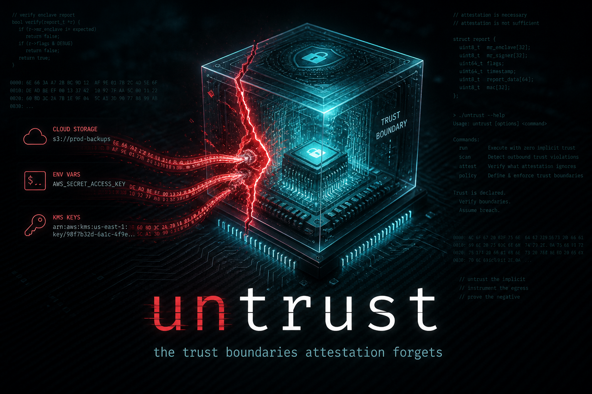
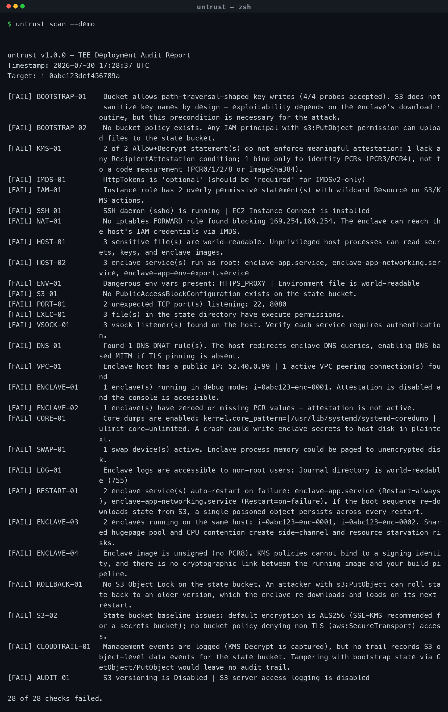
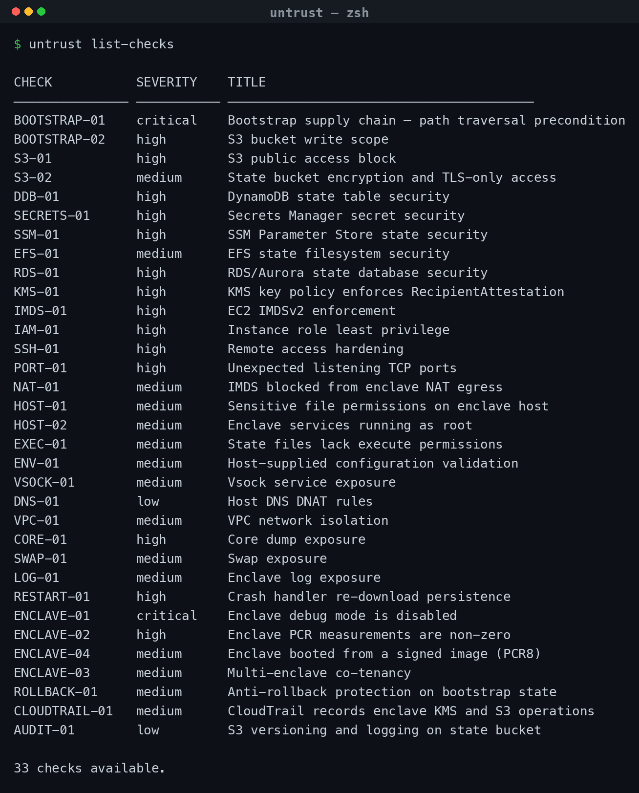

<p align="center">
  
</p>

<h1 align="center">untrust</h1>

<p align="center"><em>A TEE deployment auditor for the trust boundaries that attestation forgets.</em></p>

<p align="center">
  <a href="https://pypi.org/project/untrust/"></a>
  
  <a href="LICENSE"></a>
  
  
  <a href="https://defcon.org/"></a>
</p>

Cloud TEEs (AWS Nitro Enclaves, AMD SEV-SNP, Intel TDX) promise that a fully compromised host cannot reach into a hardware-isolated enclave. The cryptographic attestation story is sound. The deployment story is not.

Every TEE workload has to receive *something* from outside: bootstrap state from cloud object storage, environment variables from the host, KMS keys whose policies should but often don't enforce attestation. None of these inputs are protected by the attestation guarantee. All of them have been used in real exploitation.

`untrust` audits the trust boundaries TEE attestation does not cover, and produces a pass/fail report with concrete remediation guidance. It ships 62 checks for three platforms today — **AWS Nitro Enclaves** (33), **AMD SEV-SNP on GCP Confidential Space** (11), and **NVIDIA GPU Confidential Computing** (18) — behind a single `--platform` switch, and one `pip install untrust` includes all three.

---

## Why this exists

`untrust` was built after a real adversarial simulation in which a single cloud storage write permission was sufficient for full Remote Code Execution as root inside a hardware-isolated enclave. The bug was a path traversal in the bootstrap state download — a class of vulnerability from 1998 that defeated a trillion-dollar trust boundary.

The talk presenting this research was delivered at **DEF CON 34** (August 2026): *"The Enclave Is Lying to You: Breaking TEE Trust Boundaries Through Boot-Time State."*

---

## Installation

```bash
pip install untrust
```

Requires Python 3.10+. A single install includes **both** the AWS and GCP scanners — no extras. Live scans use your existing AWS credentials (Nitro) or Google Application Default Credentials (Confidential Space); demo mode needs neither.

---

## Quickstart

### Live scan against a real deployment

```bash
untrust scan \
  --target-bucket my-enclave-state \
  --kms-key-id arn:aws:kms:us-west-2:111111111111:key/abc... \
  --instance-id i-0abc123 \
  --region us-west-2 \
  --output report.json
```

### Demo mode (no AWS credentials needed)

```bash
untrust scan --demo
```

### GCP Confidential Space (SEV-SNP)

```bash
# Demo — no GCP credentials needed
untrust scan --platform gcp-cspace --demo

# List the SEV-SNP / Confidential Space checks
untrust list-checks --platform gcp-cspace

# Live scan against a Confidential Space deployment (uses Application Default Credentials)
untrust scan --platform gcp-cspace \
  --wip-provider projects/PROJECT/locations/global/workloadIdentityPools/POOL/providers/PROVIDER \
  --gcp-kms-key projects/PROJECT/locations/global/keyRings/RING/cryptoKeys/KEY \
  --gcs-bucket my-bootstrap-state \
  --gcp-instance my-cs-vm --gcp-zone us-central1-a \
  --output report.json
```

### Host attestation (SEV-SNP report / TPM2 quote)

```bash
# Demo: a correctly signed SNP report that fails every other control
untrust scan --platform host --demo

# Verify captured evidence offline against a pinned baseline and the nonce you issued
untrust scan --platform host \
  --host-evidence evidence.json --host-baseline baseline.json --host-nonce NONCE_HEX
```

Any single target flag is enough; checks whose inputs are absent report `SKIP`.

### NVIDIA GPU Confidential Computing (gpu-cc)

```bash
# Demo — no GPU, driver, or attestation evidence needed
untrust scan --platform gpu-cc --demo

# List the GPU CC checks with their trust boundary and assurance tier
untrust list-checks --platform gpu-cc

# Analyze captured evidence and policy files
untrust scan --platform gpu-cc \
  --gpu-attestation-report evidence/report.json \
  --gpu-verifier-policy policy.json \
  --gpu-kbs-policy kbs.json \
  --gpu-launch-config launch.json \
  --gpu-model-bucket my-model-weights \
  --output report-out.json
```

GPU CC is file-based: it reads a captured attestation report plus the verifier, key-release, and launch policies you supply. The retained `nvattest` outputs sit beside the report (see the [platform README](untrust/platforms/gpucc/README.md#evidence-files)). Any single target flag is enough; checks whose inputs are absent report `SKIP`.

### Sample output

Running `untrust scan --demo` against the built-in simulated deployment:

<p align="center">
  
</p>

List every check and its severity with `untrust list-checks`:

<p align="center">
  
</p>

---

## What it audits

### AWS Nitro Enclaves — 33 checks

33 checks across eight categories, each mapped to a real-world exploitation path.

### Bootstrap & Supply Chain

| Check | What it verifies | Failure enables |
|-------|-----------------|-----------------|
| **BOOTSTRAP-01** | Does the S3 bucket accept path traversal key names (`../`) in the state prefix? | Enclave RCE via a single object upload |
| **BOOTSTRAP-02** | Does the bucket policy restrict `s3:PutObject` to specific principals? | Any IAM principal can plant files in the enclave's state |

### Object Storage (state bucket)

| Check | What it verifies | Failure enables |
|-------|-----------------|-----------------|
| **S3-01** | Are all four S3 Public Access Block settings enabled? | Public exposure of bootstrap state |
| **S3-02** | Is default SSE-KMS encryption on, and a TLS-only (`aws:SecureTransport`) deny in place? | Plaintext-at-rest and in-transit MITM of state |
| **ROLLBACK-01** | Is S3 Object Lock (WORM) protecting state from rollback? | Attacker rolls state back to an older valid version the enclave re-loads |
| **AUDIT-01** | Is versioning and server access logging enabled on the state bucket? | Silent overwrite with no forensic trail |

### Alternative state backends

The bootstrap-state trust boundary is backend-agnostic — attestation covers none of these. If the enclave loads state from something other than S3, target it with the matching flag (`--dynamodb-table`, `--secret-arn`, `--parameter-path`, `--efs-id`, `--db-instance`). Each check skips unless its backend is named.

| Check | What it verifies | Failure enables |
|-------|-----------------|-----------------|
| **DDB-01** | DynamoDB state table: customer-managed CMK, PITR, deletion protection, resource-policy write scope, data-event audit | Item tampering/rollback, attestation-ungated decrypt, unaudited writes |
| **SECRETS-01** | Secrets Manager: customer-managed CMK, rotation, non-wildcard resource policy, data-event audit | Attestation-ungated secret retrieval, cross-account/wildcard read |
| **SSM-01** | Parameter Store: `SecureString` under a customer-managed CMK (not `alias/aws/ssm`) | Plaintext config/secret reads; attestation-ungated decrypt |
| **EFS-01** | EFS/EBS state filesystem: CMK encryption, TLS-enforcing FS policy, backups | Open mount, plaintext-at-rest, no recovery from tampering |
| **RDS-01** | RDS/Aurora: CMK storage encryption, not public, no `0.0.0.0/0` ingress, IAM auth, deletion protection, no public snapshots | Direct DB reach, static-password auth, public snapshot exfil |

### KMS & Attestation

| Check | What it verifies | Failure enables |
|-------|-----------------|-----------------|
| **KMS-01** | Does every Allow+Decrypt statement enforce attestation on a **real code measurement** (not all-zeros, not identity-only PCR3/PCR4)? | KMS bypass without an enclave, or a debug enclave decrypting production keys |

### IAM & Access Control

| Check | What it verifies | Failure enables |
|-------|-----------------|-----------------|
| **IMDS-01** | Is IMDSv2 enforced (`HttpTokens: required`)? | Unauthenticated credential theft via HTTP GET |
| **IAM-01** | Does the instance role have wildcard `*` on S3/KMS resources? | Enclave or attacker can access any bucket/key in the account |
| **SSH-01** | Is SSH disabled and EC2 Instance Connect removed? | Lateral movement via `SendSSHPublicKey` permission |

### Network & Host

| Check | What it verifies | Failure enables |
|-------|-----------------|-----------------|
| **NAT-01** | Does the host's network bridge filter IMDS from enclave traffic? | Host IAM credential theft from inside the enclave |
| **PORT-01** | Are there unexpected listening TCP ports on the host? | Extra remote attack surface |
| **HOST-01** | Are sensitive files (EIF, keys, secrets, env) restricted permissions? | Unprivileged credential/image theft |
| **HOST-02** | Do enclave-related systemd services run as non-root? | Instant root on service compromise |
| **EXEC-01** | Are state-directory files free of execute permissions? | Host code execution via a replaced state file |
| **VSOCK-01** | Are there vsock listeners that need manual auth review? | Unauthenticated host→enclave RPC surface |
| **DNS-01** | Does the host DNAT-redirect DNS from the enclave? | DNS-based MITM if TLS pinning is absent |
| **VPC-01** | Is the host free of public IPs, VPC peering, and transit-gateway attachments? | Broadened network reachability to the enclave host |

### Host Memory & Persistence Hygiene

| Check | What it verifies | Failure enables |
|-------|-----------------|-----------------|
| **CORE-01** | Are core dumps disabled? | A crash writes enclave-adjacent secrets to host disk in plaintext |
| **SWAP-01** | Is swap disabled? | Process memory paged to unencrypted disk |
| **LOG-01** | Are enclave journal logs restricted to root? | Unprivileged log access leaking key/token context |
| **RESTART-01** | Do enclave services avoid auto-restart + re-download of untrusted state? | Persistent re-exploitation on every restart from one poisoned object |

### Enclave Runtime

| Check | What it verifies | Failure enables |
|-------|-----------------|-----------------|
| **ENCLAVE-01** | Is the enclave running outside debug mode? | Debug enclaves zero all PCRs, defeating attestation |
| **ENCLAVE-02** | Are the enclave's PCR measurements present and non-zero? | Attestation not actually active |
| **ENCLAVE-03** | Is only one enclave running per host? | Shared hugepage/CPU contention and co-tenancy side-channels |
| **ENCLAVE-04** | Was the enclave booted from a **signed** EIF (PCR8), signature verified? | No signing identity to bind KMS to; no link to the build pipeline |

### Configuration

| Check | What it verifies | Failure enables |
|-------|-----------------|-----------------|
| **ENV-01** | Are host-supplied env files free of dangerous variables and semantically valid? | Traffic redirection (HTTPS_PROXY), state injection (BUCKET_NAME) |

### Detection & Forensics

| Check | What it verifies | Failure enables |
|-------|-----------------|-----------------|
| **CLOUDTRAIL-01** | Is a trail logging management events (KMS `Decrypt`) and S3 data events for the state bucket? | Live KMS interception and state tampering leave no audit trail |

### Host attestation (SEV-SNP / TPM2) — 6 checks

The other platforms audit the deployment around a TEE. `--platform host` checks the attestation evidence itself, offline, the way a relying party has to before it trusts a host. It takes a raw SEV-SNP report with its VCEK/ASK/ARK chain, or a TPM2 quote with its AK chain, PCR values, and event log. Every verdict depends on the signature check, which depends on a chain to a root pinned in the baseline. Full detail lives in [`untrust/platforms/host/README.md`](untrust/platforms/host/README.md).

| Check | What it verifies | Failure enables |
|-------|-----------------|-----------------|
| **HOST-CHAIN-01** | VCEK/VLEK→ASK→ARK or AK→CA chain verifies, and the root matches a pinned fingerprint | Evidence signed under an attacker's self-made root |
| **HOST-SIG-01** | Report or quote signature verifies with the certified key; no unsigned reports, no SHA-1 quotes | Fabricated evidence |
| **HOST-NONCE-01** | `REPORT_DATA` or the quote's `extraData` carries the verifier's nonce | Replay of an old, good report |
| **HOST-DEBUG-01** | SNP DEBUG and MIGRATE_MA policy bits are clear; TPM event log shows Secure Boot on, bound to a quoted PCR 7 | Host can read guest memory, or boot unsigned code |
| **HOST-TCB-01** | Reported SNP TCB (bootloader/TEE/SNP/microcode) meets the floor and matches the VCEK; TPM firmware meets the floor | Firmware rollback to known-vulnerable versions |
| **HOST-MEAS-01** | Launch measurement or PCRs match golden values; the PCRs hash to the quote and the event log replays to them | An unapproved image or boot chain |

### GCP Confidential Space (SEV-SNP) — 11 checks

The same thesis on GCP: attestation proves the code, not what you hand it at boot, nor who you let ask for the keys. On Confidential Space a workload proves itself with an attestation token and exchanges it — through Workload Identity Federation (WIF) — for Cloud KMS access. Run `untrust list-checks --platform gcp-cspace`; full detail lives in [`untrust/platforms/gcp_cspace/README.md`](untrust/platforms/gcp_cspace/README.md).

| Check | What it verifies | Failure enables |
|-------|-----------------|-----------------|
| **CSPACE-KEYBIND-01** | WIF attribute condition binds key release to a **code measurement** (`dbgstat == disabled-since-boot` **and** a pinned `image_digest`), not just identity | Key release to any workload, or a debug VM |
| **CSPACE-KMS-01** | Cloud KMS decrypt is federated only through the attested pool (`principalSet://…/workloadIdentityPools/…`), never `allUsers` or a plain service account | Attestation-ungated decrypt |
| **GCS-BOOT-01 / -02** | Bootstrap bucket is hardened (public-access prevention, uniform access, versioning) **and** rejects injection-shaped object writes | Boot-time RCE via a planted state object |
| **CSPACE-VM-01** | Instance is a real SEV-SNP Confidential VM with Shielded boot (Secure Boot, vTPM, integrity monitoring) | Isolation not actually in effect |
| **CSPACE-ATT-01** | A captured attestation token asserts non-debug, a signed image, a production (non-USABLE) image, and AMD SEV hardware | Trust placed in an untrusted runtime state |
| **CSPACE-META-01 · SA-01 · SAKEY-01 · WIF-02 · IMG-01** | Five **Tier-1 attestation-bypass** paths: VM metadata mutability (`tee-image-reference`), service-account impersonation, long-lived SA keys, weaker sibling WIF providers, and workload image signing | Running attacker code *as* the attested workload, or reaching keys with no attestation at all |

### NVIDIA GPU Confidential Computing — 18 checks

Confidential AI on H100/H200 and Blackwell: the GPU's signed attestation is sound, but the deployment around it decides whether anyone actually verifies it, and whether model weights, keys, and the launch config stay inside the boundary. A confidential-GPU deployment is **two** TEEs (the GPU and the CPU-side TDX/SEV-SNP/CCA VM), so untrust checks both and their binding. Run `untrust list-checks --platform gpu-cc`; full detail lives in [`untrust/platforms/gpucc/README.md`](untrust/platforms/gpucc/README.md).

| Check | What it verifies | Failure enables |
|-------|-----------------|-----------------|
| **GPUCC-ATT-01 · MODE-01** | The attestation report asserts CC-On, non-debug, a known GPU, and a signed report; the live CC mode is not DevTools/Off | Secrets handed to a debug or non-confidential GPU |
| **GPUCC-SIGVERIFY-01 · CERT-01 · RIM-01** | The report signature is verified by a retained, nonce-bound `nvattest` result; the device cert chain reaches NVIDIA's root; driver and VBIOS golden measurements are pinned | A forged, replayed, or downgraded report is trusted |
| **GPUCC-REATTEST-01 · FAILOPEN-01** | Attestation is continuous and fails closed on verifier error or outage | A post-attest mode flip, or a forced verifier failure, is trusted |
| **GPUCC-READY-01 · CUDA-01** | Key release and the first CUDA kernel happen only after a successful attestation, proven by a hash-linked receipt chain on the same GPU | Data and keys reach an unverified GPU |
| **GPUCC-MODEL-01 · INPUT-01 · DECRYPT-01** | The model store rejects injection-shaped writes (probed); weights load as data, with a signed manifest; decryption stays inside the TEE | Boot-time model poisoning, pickle RCE, plaintext keys in host RAM |
| **GPUCC-VRAM-01 · DMA-01** | VRAM encryption is on and CPU↔GPU DMA runs over an SPDM session | Host-readable GPU memory and PCIe traffic |
| **GPUCC-CVM-01 · BIND-01 · VMM-META-01** | The CPU-side CVM has a verified vendor quote, the GPU and CVM attestations are bound together, and the host cannot mutate the launch | A genuine GPU report relayed onto an untrusted CPU context |
| **GPUCC-KEY-01** | The DEK and workload identity are not an attestation bypass (no host-env DEK, rotation on, no SA keys or impersonators) | Keys obtained without attestation at all |

Each check carries an **assurance tier**: `report-derived` (trusted only once `GPUCC-SIGVERIFY-01` passes, otherwise flagged), `probed` (actively tested), or `operator-declared` (a policy says so). The console summary counts passes by tier so a green report is not read as stronger than its evidence.

---

## What `untrust` deliberately does *not* check (and why)

An honest scanner names its own blind spots. These threats are real, but a
deployment-config scanner cannot meaningfully test them — they require code
review, runtime introspection *inside* the enclave, or are the hardware
vendor's responsibility. Cross-referenced against the Confidential Computing
Consortium threat model, MITRE/COIN enclave-interface research, Trail of Bits'
Nitro attack-surface notes, and recent academic work (SGX.Fail, TEE.Fail).

| Threat | Why it's out of scope | Where it belongs |
|--------|----------------------|------------------|
| **Entropy source** (`rng_current` = `nsm-hwrng`) and **clock source** (`kvm-clock`) | Only observable *inside* the enclave; no host/SSM path in | Enclave runtime self-check |
| **Attestation nonce / timestamp freshness** | A property of the enclave's attestation-consuming code, not deploy config | Application code review |
| **Constant-time crypto / timing side-channels** | Requires code and microarchitectural analysis | Application code review |
| **vsock interface input validation** (MITRE COIN: Concurrent, Order, Inputs, Nested) | The bidirectional host↔enclave protocol is app-defined; `VSOCK-01` only flags that a listener exists | Application code review / fuzzing |
| **Physical & microarchitectural attacks** (TEE.Fail DDR interposition, Battering RAM, Wiretap, L3 cache) | Hardware/vendor layer; Nitro exposes no customer memory-encryption-key path and no physical operator access | AWS-managed / accepted risk |
| **Reproducible builds & independent PCR verification** | A CI/CD process control (e.g., quorum builds), not a runtime state | Build pipeline / supply-chain policy |

---

## CLI Reference

```bash
# Run all checks
untrust scan --target-bucket BUCKET --kms-key-id KEY --instance-id INSTANCE

# Audit a non-S3 state backend (any combination)
untrust scan --dynamodb-table TABLE --kms-key-id KEY
untrust scan --secret-arn ARN
untrust scan --parameter-path /enclave/
untrust scan --efs-id fs-0123 --db-instance prod-db

# Passive scan only — skip intrusive checks (the bucket canary-write probes on
# every platform and the Nitro host/nitro-cli SSM commands) to avoid tripping
# SOC/EDR detections
untrust scan --target-bucket BUCKET --kms-key-id KEY --instance-id INSTANCE --read-only

# Run in demo mode (simulated vulnerable deployment)
untrust scan --demo

# Output JSON report
untrust scan --demo --output report.json
untrust scan --demo --json

# List available checks
untrust list-checks

# --- GCP Confidential Space (SEV-SNP) ---
untrust scan --platform gcp-cspace --demo
untrust scan --platform gcp-cspace --wip-provider PROVIDER --gcs-bucket BUCKET \
  --gcp-instance VM --gcp-zone ZONE --gcp-kms-key KEY
untrust list-checks --platform gcp-cspace

# --- Host attestation (SEV-SNP report / TPM2 quote) ---
untrust scan --platform host --demo
untrust scan --platform host --host-evidence evidence.json \
  --host-baseline baseline.json --host-nonce NONCE_HEX
untrust list-checks --platform host

# --- NVIDIA GPU Confidential Computing ---
untrust scan --platform gpu-cc --demo
untrust scan --platform gpu-cc --gpu-attestation-report report.json \
  --gpu-verifier-policy policy.json --gpu-kbs-policy kbs.json --gpu-launch-config launch.json
untrust list-checks --platform gpu-cc

# Version
untrust --version
```

---

## JSON Output

The `--output` and `--json` flags produce structured output suitable for integration with CI/CD pipelines, SIEM systems, or security dashboards:

```json
{
  "version": "1.2.0",
  "timestamp": "2026-08-24T14:30:22.000000+00:00",
  "target": {
    "bucket": "enclave-state-XXXXXXXXXXXX",
    "kms_key_id": "arn:aws:kms:us-west-2:XXXXXXXXXXXX:key/demo-key-id",
    "instance_id": "i-0abc123def456789a",
    "region": "us-west-2"
  },
  "summary": {
    "total": 28,
    "pass": 0,
    "fail": 28,
    "skip": 0,
    "error": 0
  },
  "findings": [...]
}
```

---

## Roadmap

- **v1.0 (DEF CON 34, August 2026):** AWS Nitro Enclaves, 33 checks (S3 + DynamoDB/Secrets Manager/SSM/EFS/RDS state backends), JSON output
- **v1.1 — shipped:** AMD SEV-SNP on **GCP Confidential Space**, 11 checks including five Tier-1 attestation-bypass paths, behind a `--platform` switch
- **v1.2 — shipped:** **NVIDIA GPU Confidential Computing**, 18 checks across both TEEs of a confidential-GPU deployment, with per-check assurance tiers
- **Next:** SARIF output for GitHub code scanning; Intel TDX bootstrap integrity; Azure Confidential Containers
- **Future:** Plugin API for vendor-specific TEE platforms

Contributions welcome. See [CONTRIBUTING.md](CONTRIBUTING.md).

---

## How it works

For AWS Nitro, `untrust` uses the AWS SDK (boto3) and SSM to inspect the target deployment; for GCP Confidential Space (`--platform gcp-cspace`) it uses the Google API client libraries (Compute, IAM, Cloud KMS, Storage) with your Application Default Credentials; for NVIDIA GPU CC (`--platform gpu-cc`) it reads captured attestation evidence and policy files, plus the model-weights bucket on Cloud Storage; for host attestation (`--platform host`) it verifies a captured SEV-SNP report or TPM2 quote offline against a pinned baseline. Each check separates a pure `analyze_*()` function from a thin live-fetch wrapper. The AWS Nitro platform combines several families of checks (run `untrust list-checks` for the full set of 33):

- **Cloud-API checks** read S3, KMS, EC2, IAM, and CloudTrail configuration directly — e.g. `KMS-01` performs semantic key-policy evaluation (rejecting all-zeros and identity-only PCR conditions), `ROLLBACK-01` reads S3 Object Lock, `S3-02` reads bucket encryption and the TLS-only policy, and `CLOUDTRAIL-01` confirms KMS/S3 activity is actually logged.
- **Alternative-backend checks** apply the same storage-plane controls to non-S3 state stores when targeted: DynamoDB (`DDB-01`), Secrets Manager (`SECRETS-01`), SSM Parameter Store (`SSM-01`), EFS/EBS (`EFS-01`), and RDS/Aurora (`RDS-01`). Each checks for a customer-managed CMK (so `KMS-01` attestation can gate it), least-privilege/non-public access, anti-rollback, and audit coverage. CMK status is resolved authoritatively via `kms:DescribeKey` (`KeyMetadata.KeyManager`) — a string check cannot distinguish an AWS-managed service key from a customer CMK, since both surface as a resolved key ARN.
- **Host checks (via SSM `AWS-RunShellScript`)** run read-only commands on the parent instance — SSH/port/service posture, file and exec permissions, IMDS filtering, DNS DNAT, core-dump/swap/journal hygiene, and restart persistence.
- **Enclave-runtime checks (via SSM + `nitro-cli`)** confirm the enclave is out of debug mode, has non-zero PCRs, is not co-tenant, and was booted from a signed EIF (`describe-eif` → PCR8 + signature check).
- **BOOTSTRAP-01** additionally uploads canary objects with path-traversal key names and deletes any that succeed. A write that is *rejected* — with a `403 AccessDenied` **or** any other client-side (`4xx`) response such as a `400` from a bucket policy/encryption condition — is treated as **blocked (PASS)**, since the object never lands. Only transient/server-side failures (throttling, `5xx`) are reported as `ERROR`.

### Read-only mode

`untrust scan --read-only` runs the passive checks only and skips the intrusive ones — the canary-write bucket probes (`BOOTSTRAP-01` on Nitro, `GCS-BOOT-02` on Confidential Space, `GPUCC-MODEL-01` on GPU CC) and every Nitro host/enclave check that shells into the instance via SSM `AWS-RunShellScript`. Use it when you need a posture snapshot without generating write events or on-host command execution that a SOC/EDR pipeline might flag.

### Required IAM permissions

The scanning identity needs the following permissions:

```json
{
  "Version": "2012-10-17",
  "Statement": [
    {
      "Sid": "UntrustS3Checks",
      "Effect": "Allow",
      "Action": [
        "s3:PutObject",
        "s3:DeleteObject",
        "s3:GetBucketVersioning",
        "s3:GetBucketLogging",
        "s3:GetBucketPolicy",
        "s3:GetBucketPublicAccessBlock",
        "s3:GetEncryptionConfiguration",
        "s3:GetBucketObjectLockConfiguration"
      ],
      "Resource": [
        "arn:aws:s3:::YOUR-STATE-BUCKET",
        "arn:aws:s3:::YOUR-STATE-BUCKET/*"
      ]
    },
    {
      "Sid": "UntrustKms",
      "Effect": "Allow",
      "Action": "kms:GetKeyPolicy",
      "Resource": "arn:aws:kms:REGION:ACCOUNT:key/KEY-ID"
    },
    {
      "Sid": "UntrustEc2",
      "Effect": "Allow",
      "Action": [
        "ec2:DescribeInstances",
        "ec2:DescribeVpcPeeringConnections",
        "ec2:DescribeTransitGatewayVpcAttachments"
      ],
      "Resource": "*"
    },
    {
      "Sid": "UntrustCloudTrail",
      "Effect": "Allow",
      "Action": [
        "cloudtrail:DescribeTrails",
        "cloudtrail:GetTrailStatus",
        "cloudtrail:GetEventSelectors"
      ],
      "Resource": "*"
    },
    {
      "Sid": "UntrustIam",
      "Effect": "Allow",
      "Action": [
        "iam:GetInstanceProfile",
        "iam:ListRolePolicies",
        "iam:GetRolePolicy",
        "iam:ListAttachedRolePolicies",
        "iam:GetPolicy",
        "iam:GetPolicyVersion"
      ],
      "Resource": "*"
    },
    {
      "Sid": "UntrustStateBackends",
      "Effect": "Allow",
      "Action": [
        "kms:DescribeKey",
        "dynamodb:DescribeTable",
        "dynamodb:DescribeContinuousBackups",
        "dynamodb:GetResourcePolicy",
        "secretsmanager:DescribeSecret",
        "secretsmanager:GetResourcePolicy",
        "ssm:DescribeParameters",
        "elasticfilesystem:DescribeFileSystems",
        "elasticfilesystem:DescribeFileSystemPolicy",
        "elasticfilesystem:DescribeBackupPolicy",
        "rds:DescribeDBInstances",
        "rds:DescribeDBSnapshots",
        "rds:DescribeDBSnapshotAttributes",
        "ec2:DescribeSecurityGroups"
      ],
      "Resource": "*"
    },
    {
      "Sid": "UntrustSsm",
      "Effect": "Allow",
      "Action": [
        "ssm:SendCommand",
        "ssm:GetCommandInvocation"
      ],
      "Resource": [
        "arn:aws:ssm:REGION:ACCOUNT:document/AWS-RunShellScript",
        "arn:aws:ec2:REGION:ACCOUNT:instance/INSTANCE-ID"
      ]
    }
  ]
}
```

**BOOTSTRAP-01** writes canary objects to the target bucket and deletes them after — scope the `s3:PutObject`/`s3:DeleteObject` actions to a dedicated audit role. The **host and enclave-runtime checks** (SSH-01, PORT-01, NAT-01, HOST-01, HOST-02, EXEC-01, ENV-01, VSOCK-01, DNS-01, CORE-01, SWAP-01, LOG-01, RESTART-01, ENCLAVE-01/02/03/04) execute read-only shell/`nitro-cli` commands on the host via SSM — ensure the SSM agent is running and the instance profile allows SSM sessions. The remaining checks use S3, KMS, EC2, IAM, and CloudTrail read APIs.

On GCP, **GCS-BOOT-02** (Confidential Space) and **GPUCC-MODEL-01** (GPU CC) write and then delete canary objects in the target bucket the same way, so the identity needs `storage.objects.create` and `storage.objects.delete` there; use `--read-only` to skip them.

---

## Background reading

- [AWS Nitro Enclaves User Guide](https://docs.aws.amazon.com/enclaves/latest/user/nitro-enclave.html)
- [Cryptographic Attestation with AWS KMS for Nitro Enclaves](https://docs.aws.amazon.com/kms/latest/developerguide/services-nitro-enclaves.html)
- [NCC Group, "Public Report — AWS Nitro System Security Review" (2023)](https://research.nccgroup.com/2023/04/)
- [Trail of Bits, "Security Assessment of AWS Nitro Enclaves" (2022)](https://github.com/trailofbits/publications)
- [OWASP, "Path Traversal"](https://owasp.org/www-community/attacks/Path_Traversal)

---

## Disclosure

The vulnerabilities that motivated this tool were discovered during an authorized adversarial simulation against a production TEE deployment. They were reported to the affected vendor, and fixes shipped in a subsequent build. Coordinated disclosure is complete. `untrust` does not include any vendor-specific exploit code or proprietary information — it implements the audit checks generically against published cloud APIs.

---

## License

MIT. See [LICENSE](LICENSE).

---

## Author

[Sandeep Jayashankar](https://github.com/pyro-0x) (pyro) — offensive cloud security researcher.

DEF CON 34 speaker. Focus: adversarial simulation against confidential computing deployments.
